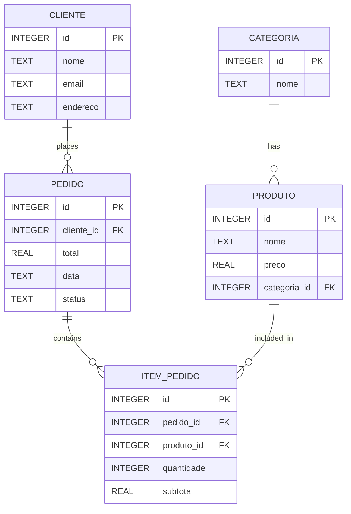

# App_PedeJa

Academic project developed for mobile programming course inspired by delivery apps.

## 📱 Overview

PedeJá simulates a basic food delivery system, allowing management of:

- Product categories  
- Products  
- Customers  
- Orders  
- Order items  

The goal is to represent a real-world delivery flow using a structured relational database.

## 🗄️ Database Diagram

