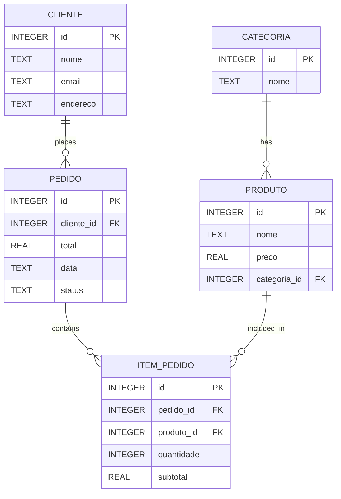

# App_PedeJa

Academic project developed for mobile programming course inspired by delivery apps.
This application consumes the **PedeJa REST API**, allowing users to interact with a food delivery system through a native Android interface.

---

## 🚀 Technologies

- Java
- XML
- Android Studio
- Gradle
- REST API Integration
- HTTP Requests
- SQLite (backend persistence)
- Material Design Components

---

## 📱 Features

### Category Browsing
- List product categories

### Product Catalog
- Browse available products
- View product details

### Order Management
- Create new orders
- View order history
- Track order status

### Order Items
- Add products to orders
- Quantity management
- Automatic subtotal calculation

### API Integration
- Consume backend REST endpoints
- Real-time data synchronization

---

## 🏗️ Application Architecture

The mobile app follows a client-server architecture:

```text
Android App (Java/XML)
        ↓
HTTP Requests
        ↓
PedeJa REST API (Spring Boot)
        ↓
SQLite Database
```

## 📱 Overview

PedeJá simulates a basic food delivery system, allowing management of:

- Product categories  
- Products  
- Customers  
- Orders  
- Order items  

The goal is to represent a real-world delivery flow using a structured relational database.

## 🗄️ Database Diagram



## 📲 Screens

The application includes the following main screens:

- Home Screen
- Customer Registration
- Product Listing
- Order Creation
- Order Item Management

> Screenshots will be added soon.

---

## 🔌 Backend Integration

This mobile application consumes the **PedeJa REST API**, integrating with the following endpoints:

- `/customers`
- `/categories`
- `/products`
- `/orders`
- `/order-items`

**Backend Repository:**  
[[Link to PedeJa API repository](https://github.com/Gabrieodev/PedeJa_API)]

---

## ▶️ Running the Project

### Prerequisites

Before running the application, make sure you have installed:

- Android Studio
- JDK 21
- Gradle
- PedeJa API running locally

### Installation

Clone the repository:

```bash
git clone <repository-url>
```

Open the project in **Android Studio**.

Configure the API base URL if necessary.

Run the backend server:

```bash
mvn spring-boot:run
```

Start an Android emulator or connect a physical device.

Run the application directly from Android Studio.

---

## 🎯 Future Improvements

Planned enhancements for future versions:

- Authentication and Authorization
- User Login and Registration
- Shopping Cart
- Payment Integration
- Push Notifications
- Real-Time Order Tracking
- Dark Mode
- UI/UX Improvements
- Retrofit Implementation
- MVVM Architecture

---

## 🙏 Acknowledgments

Special thanks to my project team and professors for their collaboration, guidance, and shared knowledge throughout the development of this application.

This project was an important opportunity to strengthen practical skills in **Mobile Development, Backend Integration, teamwork, and Software Architecture**.
